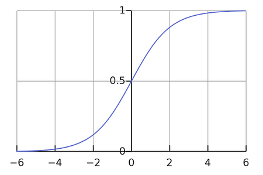
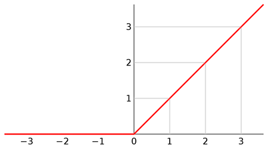
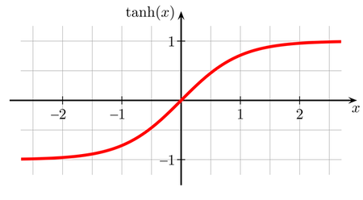
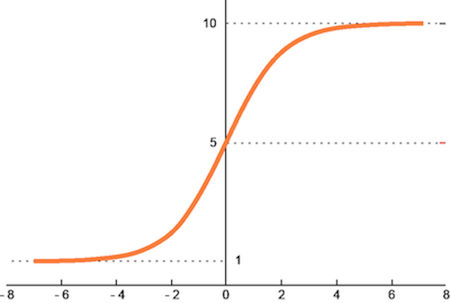

# Activation Functions in AI Models

Activation functions play a crucial role in the architecture of artificial intelligence (AI) models, especially in neural networks. They are essential for introducing non-linearity, enabling models to learn complex patterns and make decisions beyond simple linear predictions.

## Key Roles of Activation Functions

- **Introducing Non-Linearity**: Without activation functions, neural networks would be unable to model complex data such as images, text, and audio. Activation functions allow these networks to capture and represent non-linear relationships.

- **Determining Neuron Activation**: By deciding whether a neuron should fire based on the input received, activation functions control the flow of information within the network, effectively enabling the network to perform complex decision-making.

- **Enabling Deep Learning**: The non-linearity introduced by activation functions is what allows deep neural networks to learn hierarchically, with deeper layers building more abstract representations of the input data.

## Common Types of Activation Functions

- **Sigmoid**: 
$$
σ(x) = 1 / (1 + e^(-x))
$$
Provides output between 0 and 1, making it suitable for binary classification. However, it's less used in deep networks due to the vanishing gradient problem.

- **ReLU (Rectified Linear Unit)**: 
$$
f(x) = max(0, x)
$$
Offers efficient training and simplicity, making it one of the most widely used activation functions in deep learning models. It outputs the input directly if it is positive, else it will output zero.

- **Tanh (Hyperbolic Tangent)**: 
$$
tanh(x) = (e^(x) - e^(-x)) / (e^(x) + e^(-x))
$$
Outputs values between -1 and 1, providing a zero-centered range which can lead to faster convergence in some cases.

- **Softmax**: 
$$
Softmax(x_i) = e^(x_i) / Σ(e^(x_j))
$$
Converts the output layer into a probability distribution, making it ideal for multi-class classification tasks.

## Activation Functions During Inference

- In the inference phase, activation functions still play their crucial role, processing inputs through the learned weights and biases to produce the output.
  
- The choice of activation function in the output layer is particularly important, as it shapes the form and interpretation of the model's predictions (e.g., probabilities for classification, continuous values for regression).

## Conclusion

Activation functions are a foundational element of neural network design, enabling networks to learn complex patterns and perform a wide range of tasks. Their selection and application are critical for the model's performance and ability to generalize from training to inference.